# Crypto Market Intelligence Radar (CMIR)

## Detect unusual crypto market behavior before it becomes obvious.

CMIR is an explainable crypto intelligence terminal built on CoinMarketCap market data.

Unlike traditional dashboards that show prices and rankings, CMIR detects unusual market behavior, explains why it matters, tracks capital rotation across sectors, and allows users to replay signals historically.

### CoinMarketCap shows what is happening.

### CMIR shows what deserves attention and why.

* No black-box AI
* No automated trading decisions
* Fully explainable deterministic signals
* Replayable market events
* Capital Rotation Intelligence

---

# Built for CoinMarketCap API Hackathon

CMIR continuously analyzes CoinMarketCap Top 100 assets and transforms raw market data into explainable intelligence.

CoinMarketCap provides:

* Prices
* Market Cap
* Rankings
* 1H / 24H Performance

CMIR adds:

* Anomaly Detection
* Capital Rotation
* Sector Intelligence
* Historical Replay
* Explainable Narratives

---

# Demo Screenshots

## Market Intelligence Terminal

<p align="center">
  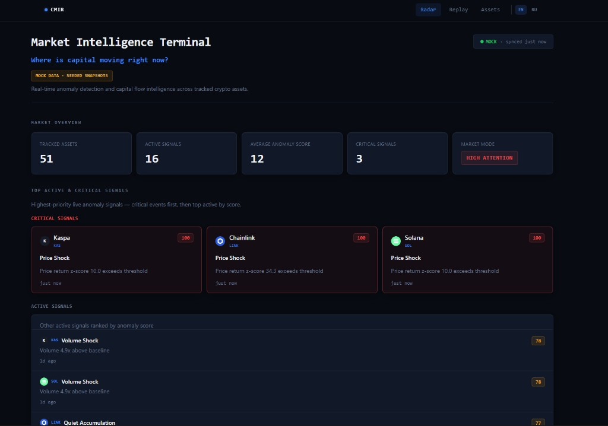
</p>

Shows the highest-priority active anomalies immediately.

Critical events appear first, followed by opportunities, capital rotation, and market intelligence.

---

## Top Opportunities & Opportunity Feed

<p align="center">
  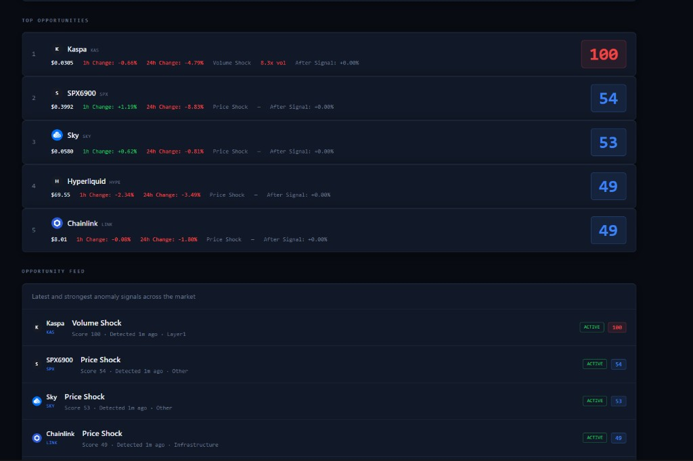
</p>

Highlights the strongest opportunities based on Radar Score and active anomaly signals.

Users immediately see:

* strongest assets
* signal type
* score
* sector
* detection time

---

## Capital Rotation & Market Story

<p align="center">
  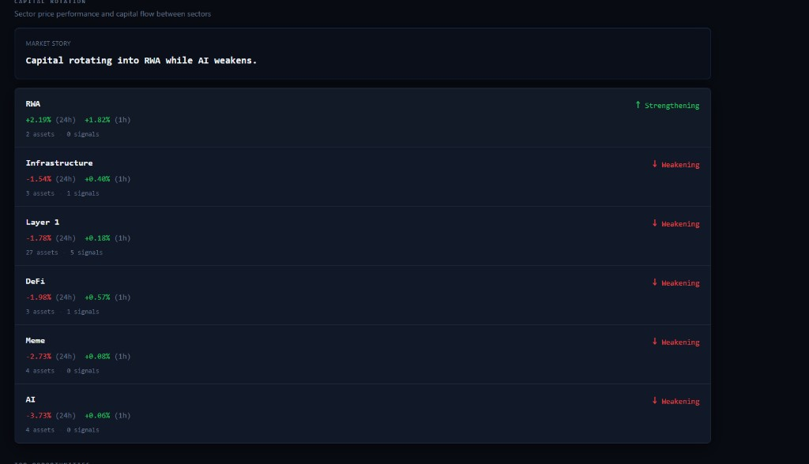
</p>

Shows where capital is moving right now.

Example:

> Capital rotating into RWA while AI weakens.

This transforms raw sector performance into a readable market narrative.

---

## Signal Replay

<p align="center">
  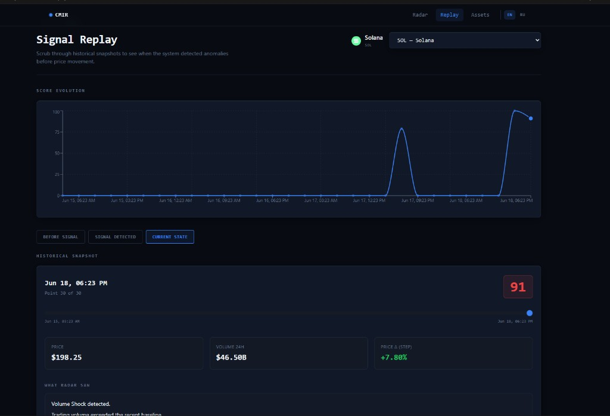
</p>

Replay historical snapshots and inspect:

* Before Signal
* Signal Detected
* Current State

Replay proves that CMIR detected unusual behavior before it became obvious.

---

## Asset Intelligence — Active Signal

<p align="center">
  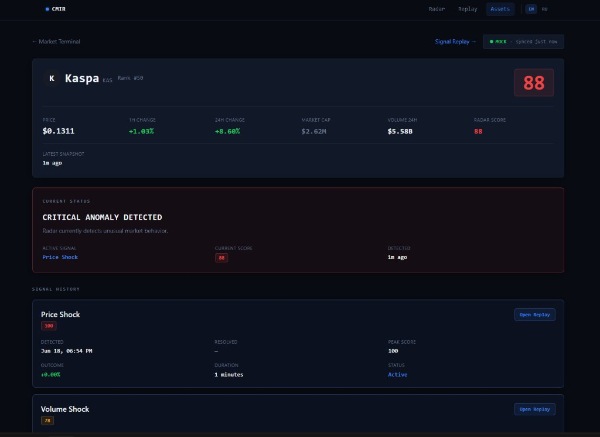
</p>

Deep dive into a live anomaly.

Users can inspect:

* Why Radar flagged the asset
* Current score
* Signal explanation
* Price and volume context

---

## Asset Intelligence — Historical Signals

<p align="center">
  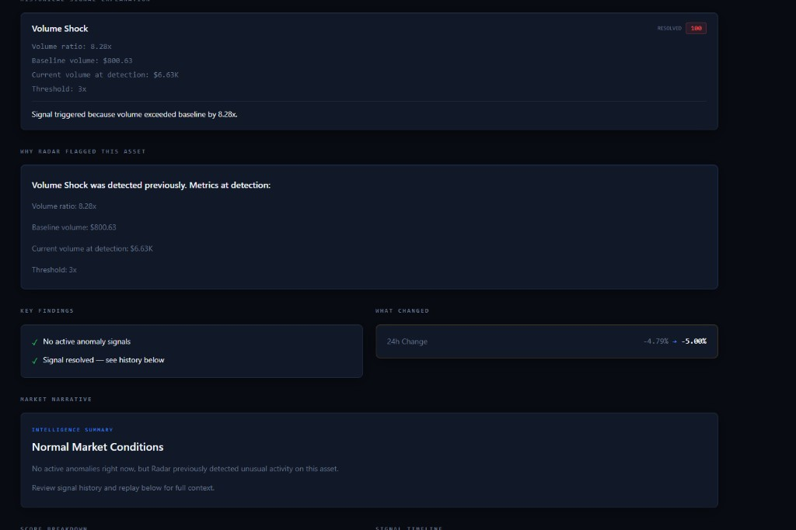
</p>

Historical signals remain visible even after resolution.

Users can answer:

> Why was this asset flagged?

at any time.

---

## Market Map

<p align="center">
  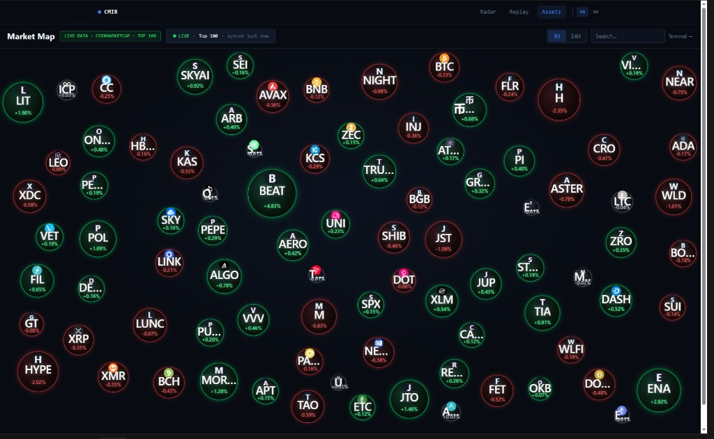
</p>

Interactive crypto heatmap for Top 100 assets.

Features:

* 1H / 24H modes
* Physics-based layout
* Intelligence overlays
* Asset drilldown

---

# Why CMIR Exists

Most crypto dashboards answer:

> What is happening?

CMIR answers:

| Question | CMIR |
| -------- | ---- |
| What deserves attention? | Prioritized signals |
| Why is it unusual? | Explainable metrics |
| When did it start? | Historical replay |
| What happened after? | Signal outcome tracking |
| Where is capital moving? | Sector intelligence |

---

# What Makes CMIR Different?

<p align="center">
  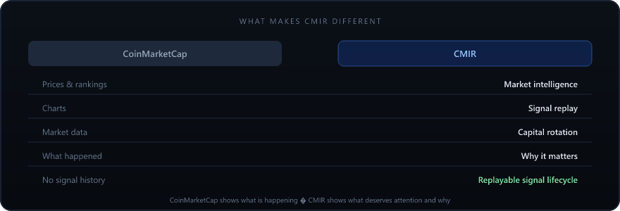
</p>

---

# Product Overview

<p align="center">
  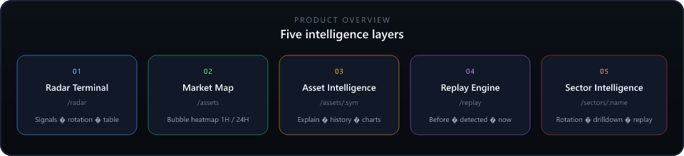
</p>

| Layer | Purpose |
| ----- | ------- |
| Radar Terminal | Market-wide intelligence |
| Market Map | Visual exploration |
| Asset Intelligence | Explainable anomaly analysis |
| Replay Engine | Historical verification |
| Sector Intelligence | Capital flow tracking |

---

# Data Pipeline

<p align="center">
  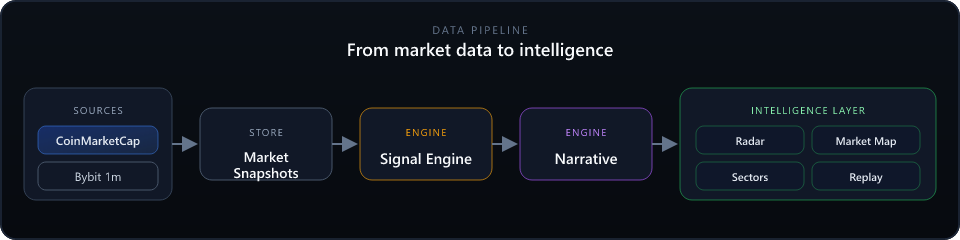
</p>

```
CoinMarketCap + Bybit
        ↓
Market Snapshots
        ↓
Signal Engine
        ↓
Narrative Engine
        ↓
Radar · Replay · Market Map · Sector Intelligence
```

---

# Signal Engine

CMIR uses deterministic rules instead of machine learning.

## Volume Shock

Detects abnormal volume expansion.

Trigger:

`volume_ratio >= 3x`

## Price Shock

Detects abnormal price movement using z-score analysis.

Trigger:

`|z-score| >= 3`

## Quiet Accumulation

Detects volume growth while price remains relatively flat.

Trigger:

`volume_ratio >= 3x` AND `|24h change| <= 2%`

## Radar Score

Composite score:

* Volume Shock
* Price Shock
* Quiet Accumulation

Output:

* Score
* Severity
* Narrative
* Lifecycle

---

# Replay Engine

Most anomaly systems generate alerts.

CMIR generates explainable historical evidence.

<p align="center">
  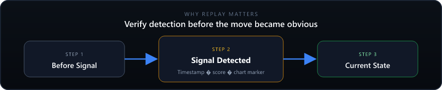
</p>

Users can verify:

* what happened before detection
* when the anomaly appeared
* how the score evolved
* what happened after

---

# Sector Intelligence

Features:

* Capital Rotation
* Sector Drilldown
* Sector Replay
* Market Story

Routes:

`/sectors/[sector]`

`/replay/sector/[sector]`

---

# Architecture

<p align="center">
  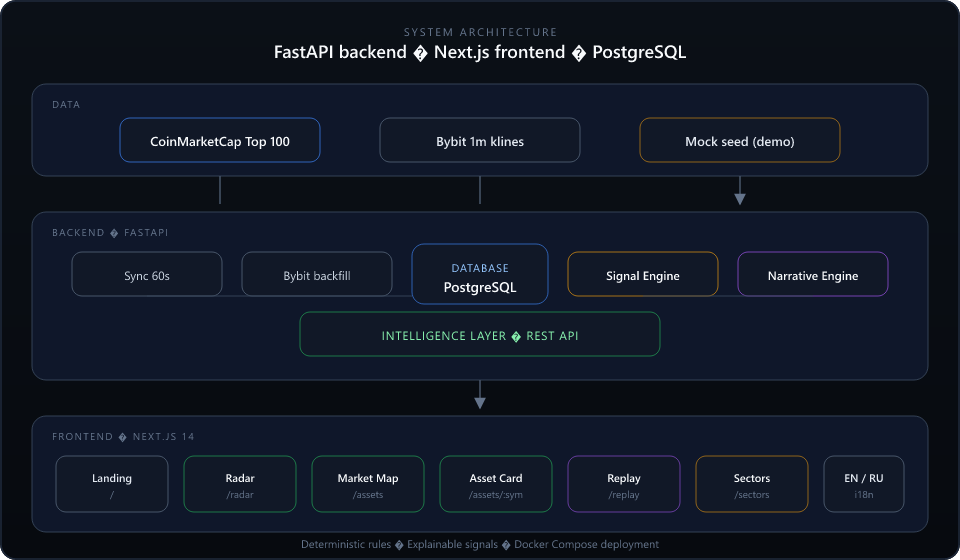
</p>

---

# Tech Stack

**Frontend**

* Next.js 14
* TypeScript
* Tailwind
* Recharts

**Backend**

* FastAPI
* SQLAlchemy 2
* Pydantic v2

**Database**

* PostgreSQL 16

**Infrastructure**

* Docker Compose

**Data**

* CoinMarketCap
* Bybit

---

# Judge Demo Flow

Recommended 2-minute demo:

1. Open Radar
2. Inspect Critical Signals
3. Open Asset Intelligence
4. View Signal History
5. Open Replay
6. Verify detection timeline
7. Explore Capital Rotation
8. Open Market Map

**Result:** CMIR demonstrates how market data becomes explainable market intelligence.

---

# Roadmap

* Sector Replay
* Historical Signal Outcomes
* Market Story
* Bubble Map
* WebSocket Live Feed
* Alerts
* Watchlists
* Multi-Exchange Support
* Optional LLM Summaries

---

# CoinMarketCap Hackathon

CMIR transforms CoinMarketCap market data into explainable intelligence.

Instead of showing only prices, CMIR explains:

* what matters
* why it matters
* when it started
* what happened next

All without black-box decision making.
