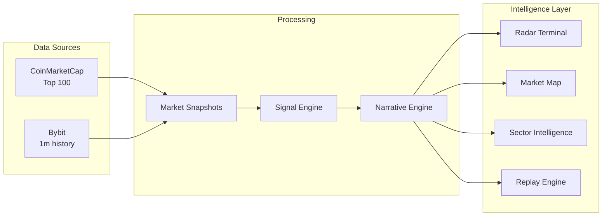
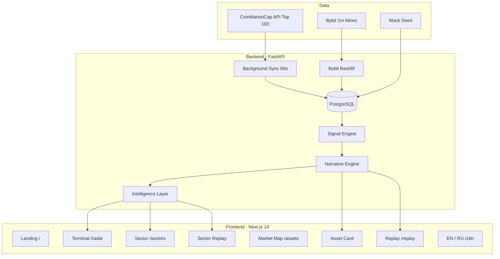
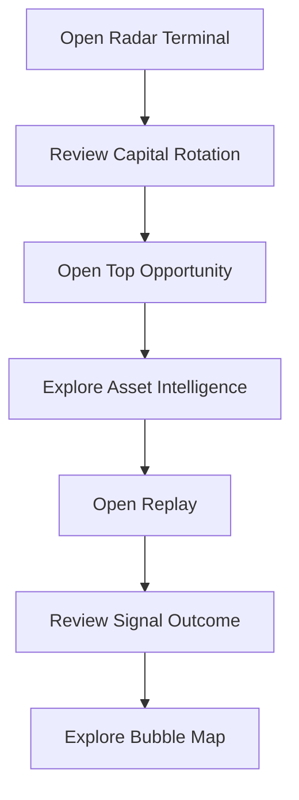

# Crypto Market Intelligence Radar (CMIR)

**See unusual crypto market behavior before it becomes obvious.**

CMIR is an explainable crypto intelligence terminal built on CoinMarketCap market data.

Instead of only showing prices and rankings, CMIR detects unusual market behavior, explains why it matters, tracks capital rotation across sectors, and provides replay functionality to show what happened before and after a signal.

> *AI does not decide signals. Deterministic market logic is the source of truth.*

**Key principles**

- No AI-generated trading decisions
- No black-box models
- Fully explainable, rule-based signals

---

## The Problem

Crypto dashboards answer:

> *What is happening?*

But they rarely answer:

- What deserves attention?
- Why is it unusual?
- When did it start?
- What happened after the signal?

Traders spend hours scanning hundreds of assets, sectors, and charts.

**CMIR turns raw market data into actionable market intelligence.**

---

## Solution

CMIR combines:

- CoinMarketCap Top 100 market data
- Bybit minute-level history
- Deterministic Signal Engine
- Sector Intelligence
- Capital Rotation
- Replay Engine

### Pipeline



```
CoinMarketCap + Bybit
        ↓
Market Snapshots
        ↓
Signal Engine
        ↓
Narrative Engine
        ↓
Radar Terminal · Market Map · Sector Intelligence · Replay
```

---

## Key Features

### Radar Terminal (`/radar`)

The command center for market-wide intelligence.

- **Market Overview** — KPIs: assets, signals, avg score, critical count, market mode
- **Market Story** — rule-based narrative: capital rotation, sector signals, score delta
- **Capital Rotation** — sector leaders and laggards; click through to drilldown
- **Top Opportunities** — highest Radar Score assets
- **Opportunity Feed** — latest and strongest signals with quick asset links
- **Recent Market Events** — active and resolved signals with post-signal price move
- **Intelligence Feed** — stream of active anomalies
- **Radar Table** — search, filters, sort across Top 100

### Market Map (`/assets`)

Interactive bubble map for Top 100 tradable assets (stablecoins excluded).

- **1H / 24H modes** — bubble size and color driven by price change
- **Physics-based layout** — dynamic movement with collision detection
- **Sector exploration** — optional sector heat layers
- **Intelligence cards** — hover for 1h/24h change, price, market cap, Radar Score
- **Asset modal** — click a bubble for detail, stats, and mini chart

### Asset Intelligence (`/assets/[symbol]`)

Deep dive for every asset:

- **Why Radar Flagged** — explanation with real numbers (z-score, volume ratio)
- **Signal History** — resolved signals with outcome, duration, replay links
- **Signal Outcome** — results of closed signals
- **Key Findings & What Changed** — score delta, narrative, volume ratio
- **Replay** — jump to historical signal context
- **Price & Volume charts** — detection markers on timeline

### Replay (`/replay`)

Time machine for market signals.

Jump directly to:

- **Before Signal**
- **Signal Detected**
- **Current State**

Use `?signal_id=` to jump to a specific historical signal.

Replay demonstrates how early the system detected unusual market behavior — not just what happened after the fact.

### Sector Intelligence

- **Capital Rotation** — where money is moving across sectors
- **Sector Drilldown** (`/sectors/[sector]`) — score, narrative, top assets, active signals
- **Sector Replay** (`/replay/sector/[sector]`) — sector score evolution over snapshots
- **Market Story** — cross-sector narrative on the Radar terminal

### Localization

- **English / Russian** — navbar toggle, browser auto-detect, `localStorage` persistence
- UI, signal types, sectors, and narrative strings translated on the client

---

## Signal Engine

CMIR uses **deterministic rules**, not ML. Minimum **15 snapshots** of history. Lifecycle: `active` → `resolved`.

### Volume Shock

Volume significantly exceeds baseline (20 previous snapshots). In live mode, **1-minute Bybit turnover** is used — not mixed with CMC 24h volume.

| Condition | `volume_ratio >= 3.0` |
|-----------|------------------------|
| Score | `min(100, round(max(0, ratio − 3) × 20 + 40))` |

### Price Shock

Return z-score exceeds threshold.

| Condition | `\|z_score\| >= 3.0`, std >= 0.001 |

### Quiet Accumulation

Volume increases while price remains flat.

| Condition | `volume_ratio >= 3.0` AND `\|24h %\| <= 2.0` |

### Radar Score (Composite)

| Component | Weight |
|-----------|--------|
| Volume Shock | 0.35 |
| Price Shock | 0.30 |
| Quiet Accumulation | 0.35 |

### Narrative Engine

| Active signals | Narrative |
|----------------|-----------|
| Quiet Accumulation | ACCUMULATION |
| Volume + Price | MOMENTUM_EXPANSION |
| Price only | VOLATILITY_EVENT |
| Volume only | VOLUME_ANOMALY |
| None active | NORMAL |

**Outputs:** Radar Score · Severity · Narrative · Signal Lifecycle

---

## Why It Is Different

| Traditional Dashboard | CMIR |
|-----------------------|------|
| Prices | **Signals** |
| Rankings | **Intelligence** |
| Market data | **Capital Rotation** |
| Charts | **Replay** |
| What happened | **Why it matters** |
| Black box | **Explainable rules** |

---

## Architecture



---

## Tech Stack

| Layer | Technologies |
|-------|--------------|
| **Frontend** | Next.js 14, TypeScript, Tailwind CSS, Recharts |
| **Backend** | Python 3.12, FastAPI, SQLAlchemy 2, Pydantic v2, Alembic |
| **Database** | PostgreSQL 16 |
| **Infrastructure** | Docker Compose |
| **Data sources** | CoinMarketCap `listings/latest` (Top 100) · Bybit turnover (live) or seed (mock) |

---

## Run Locally

### Quick start (mock mode — no API keys)

```bash
cp .env.example .env
docker compose up --build
```

Full database reset + seed:

```bash
docker compose down -v
docker compose up --build
```

| Service | URL |
|---------|-----|
| **Frontend** | http://localhost:3000 |
| **Radar Terminal** | http://localhost:3000/radar |
| **Market Map** | http://localhost:3000/assets |
| **Asset (demo)** | http://localhost:3000/assets/SOL |
| **Replay** | http://localhost:3000/replay?symbol=SOL |
| **Sector (demo)** | http://localhost:3000/sectors/DeFi |
| **Sector Replay** | http://localhost:3000/replay/sector/DeFi |
| **Backend / Swagger** | http://localhost:8000/docs |

Mock mode works without API keys — ideal for demos and judging.

### Live mode (CoinMarketCap + Bybit)

```env
CMC_API_KEY=your_key_here
CMC_LISTINGS_LIMIT=100
CMC_SYNC_INTERVAL_SECONDS=60
BYBIT_BACKFILL_ENABLED=true
```

Get a CMC key: https://coinmarketcap.com/api/

Dashboard badge: `LIVE DATA · CoinMarketCap · Top 100`

---

## Demo Flow



| Step | URL | What to show |
|------|-----|--------------|
| 1 | http://localhost:3000/radar | Market Story → Capital Rotation → Top Opportunities |
| 2 | http://localhost:3000/sectors/DeFi | Sector drilldown: score, narrative, signals |
| 3 | http://localhost:3000/assets/SOL | Why Flagged, Signal History, charts with markers |
| 4 | http://localhost:3000/replay?symbol=SOL | Timeline before the price move |
| 5 | http://localhost:3000/replay?symbol=SOL&signal_id=1 | Replay a specific historical signal |
| 6 | http://localhost:3000/assets | Bubble map — 1H / 24H, physics, intelligence cards |
| 7 | http://localhost:3000/replay/sector/DeFi | Sector score evolution over time |

---

## API

| Method | Endpoint | Description |
|--------|----------|-------------|
| GET | `/api/system/status` | Data source, sync interval, freshness |
| GET | `/api/radar` | Assets ranked by Radar Score + narrative |
| GET | `/api/signals` | Active signals |
| GET | `/api/signals/recent` | Recent market events with price move |
| GET | `/api/market-rotation` | Capital rotation by sector |
| GET | `/api/market-story` | Rule-based market story |
| GET | `/api/opportunities` | Latest / strongest signals |
| GET | `/api/sectors/{sector}` | Sector drilldown |
| GET | `/api/assets/{symbol}` | Detail, breakdown, timeline, `historical_signals[]` |
| GET | `/api/assets/{symbol}/snapshots` | Snapshot history (price, volume) |
| GET | `/api/replay/{symbol}` | Historical replay; `?signal_id=` for jump |
| GET | `/api/replay/sector/{sector}` | Sector score timeline + narrative |

---

## Project Structure

```
ragnaR/
├── backend/
│   ├── app/
│   │   ├── signals/          # Volume / Price / Quiet + volume_metrics
│   │   ├── services/         # CMC sync, Bybit backfill, narrative, sector intelligence
│   │   └── api/routes/       # REST endpoints
│   └── alembic/
├── frontend/
│   ├── app/                  # /, /radar, /assets, /replay, /sectors
│   ├── components/           # Terminal UI, bubbles, charts, intelligence blocks
│   └── lib/i18n/             # EN / RU dictionaries
├── docker-compose.yml
└── .env.example
```

---

## Roadmap

- [x] Sector Drilldown + Sector Replay
- [x] Market Story + Opportunity Feed
- [x] Signal History + replay by `signal_id`
- [x] Bubble map Top 100 (1H / 24H)
- [ ] Real-time WebSocket feed
- [ ] Alerts (Telegram / email)
- [ ] Watchlists
- [ ] Multi-exchange support
- [ ] Optional LLM summaries *on top of* deterministic signals (summarize, not decide)

---

## CoinMarketCap Hackathon

Built for the **CoinMarketCap API Hackathon**.

CMIR demonstrates how market data can be transformed into explainable intelligence, sector analytics, and replayable market events — without hiding the logic behind a black box.

---

<p align="center">
  <strong>Crypto Market Intelligence Radar</strong><br/>
  Detect unusual crypto market behavior before it becomes obvious.
</p>
