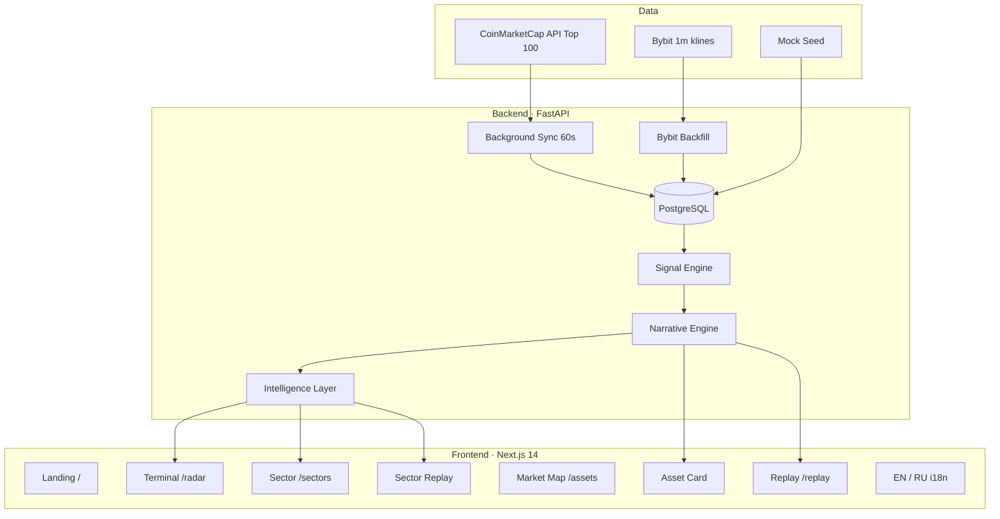

# Crypto Market Intelligence Radar

**Увидеть необычное на крипторынке — до того, как это станет очевидным.**

CMIR (Crypto Market Intelligence Radar) — explainable intelligence-терминал, который превращает рыночные данные в детерминированные сигналы, narrative и приоритеты. Без чёрного ящика. Без AI, который сам решает, что важно.

> *AI does not decide signals. Deterministic market logic is the source of truth.*

---

## Проблема

Крипторынок генерирует тысячи метрик в секунду. Трейдер и аналитик видят таблицы, проценты и алерты — но не ответы на главные вопросы:

- **Что** именно необычно?
- **Почему** это не похоже на норму?
- **Насколько** это важно прямо сейчас?
- **Когда** система это увидела — до или после движения цены?

CoinMarketCap показывает *что происходит*.  
**Radar показывает, что заслуживает внимания — и объясняет почему.**

---

## Решение

```
Market Data  →  Signal Engine  →  Narrative  →  Intelligence Layer  →  Action
     │               │                │                    │                │
  CMC + Bybit    Volume Shock      ACCUMULATION         Sector Drilldown   /radar
                 Price Shock       VOLATILITY           Market Story       /sectors
                 Quiet Accum.      NORMAL               Opportunity Feed   /assets
                                                              │             /replay
                                                         Sector Replay
```

1. **Сбор данных** — CoinMarketCap Top 100 (live) или seeded snapshots (mock); Bybit backfill для минутной истории.
2. **Детекция** — три детерминированных сигнала аномалий.
3. **Scoring** — Radar Score + severity (Critical / Significant / Watch / Normal).
4. **Narrative** — Accumulation, Momentum Expansion, Volatility Event…
5. **Intelligence Layer** — sector drilldown, market story, opportunity feed, sector replay.
6. **Explainability** — Why Flagged, Key Findings, Signal History, Replay с доказательством раннего детекта.

---

## Демо за 60 секунд

| Шаг | URL | Что показать |
|-----|-----|--------------|
| 1 | http://localhost:3000 | Landing + переключатель **EN / RU** |
| 2 | http://localhost:3000/radar | «Куда движется рынок?» → Market Story → Capital Rotation → Top Opportunities → Opportunity Feed → Events → Table |
| 3 | http://localhost:3000/sectors/DeFi | Sector Drilldown: score, narrative, top assets, active signals |
| 4 | http://localhost:3000/replay/sector/DeFi | Sector Replay — эволюция sector score по snapshot'ам |
| 5 | http://localhost:3000/assets | **Market Map** — bubble-карта Top 100 (без USDT/стейблов) |
| 6 | http://localhost:3000/assets/SOL | Asset Intelligence: Signal History, Why Flagged, charts с маркерами |
| 7 | http://localhost:3000/replay?symbol=SOL | Timeline: score и сигналы *до* скачка цены |
| 8 | http://localhost:3000/replay?symbol=SOL&signal_id=1 | Replay конкретного исторического сигнала |

**Mock mode** работает без API-ключей — идеально для стенда и жюри.

---

## Ключевые возможности

### Market Intelligence Terminal (`/radar`)

- **Market Overview** — KPI: активы, сигналы, avg score, critical count, Market Mode
- **Market Story** — rule-based повестка: ротация капитала, sector signals, score delta
- **Capital Rotation** — sector narrative, лидеры и отстающие; клик → drilldown
- **Top Opportunities** — топ по Radar Score
- **Opportunity Feed** — последние и сильнейшие сигналы с быстрым переходом к активу
- **Recent Market Events** — последние сигналы (active + resolved) с post-signal price move
- **Intelligence Feed** — лента активных аномалий
- **Radar Table** — поиск, фильтры, сортировка по 100 активам

### Sector Intelligence (`/sectors/[sector]`)

- Sector Radar Score, avg score, active signals, asset count
- Sector narrative (rule-based, как Capital Rotation)
- Top assets и active signals в секторе
- Ссылка на **Sector Replay**

### Sector Replay (`/replay/sector/[sector]`)

- Timeline sector radar score по историческим snapshot'ам
- Score change, leader at start/end, signals per point
- Rule-based narrative по динамике сектора

### Market Map (`/assets`)

- **Bubble-карта** в духе CryptoBubbles — физика, CMIR-палитра, Top 100
- Режимы: **1H · 24H** (размер/цвет по % изменения)
- Клик на пузырь → модал с ценой, stats и мини-графиком
- Фильтр flat-токенов и stablecoins (USDT и др.)

### Asset Intelligence Card (`/assets/[symbol]`)

- Current Status — активен ли сигнал прямо сейчас
- **Signal History** — resolved-сигналы с outcome, duration, ссылкой на replay
- Why Radar Flagged — объяснение с реальными числами (z-score, volume ratio)
- Key Findings & What Changed — delta score, narrative, volume ratio
- Signal Outcome — результат закрытых сигналов
- Score Breakdown + Signal Timeline
- **Price & Volume charts** с маркерами момента детекции

### Signal Replay (`/replay`)

- Timeline slider по историческим snapshot'ам
- Quick jump: Before Signal → Signal Detected → Current State
- Price, Volume, Score, Signals, Narrative на каждой точке
- **`?signal_id=`** — jump к конкретному историческому сигналу

### Локализация

- **English / Русский** — переключатель в navbar, сохранение в `localStorage`
- Автоопределение языка браузера
- Переводы UI, типов сигналов, секторов, narrative types
- Backend narrative strings переводятся на клиенте через pattern-matching (`translateMarketNarrative`)

---

## Signal Engine

Все сигналы — **правила, не ML**. Минимум **15 snapshot'ов** истории. Lifecycle: `active` → `resolved`.

### Volume Shock

Объём существенно выше baseline (20 предыдущих snapshots). В live-режиме сравнивается **1-минутный turnover Bybit** (не смешивается с CMC 24h).

| Условие | `volume_ratio >= 3.0` |
| Score | `min(100, round(max(0, ratio − 3) × 20 + 40))` |

### Price Shock

Z-score по **returns между snapshots**.

| Условие | `\|z_score\| >= 3.0`, std >= 0.001 |

### Quiet Accumulation

Объём растёт, цена остаётся flat.

| Условие | `volume_ratio >= 3.0` AND `\|24h %\| <= 2.0` |

### Radar Score (Composite)

| Компонент | Вес |
|-----------|-----|
| Volume Shock | 0.35 |
| Price Shock | 0.30 |
| Quiet Accumulation | 0.35 |

### Narrative Engine

| Активные сигналы | Narrative |
|------------------|-----------|
| Quiet Accumulation | ACCUMULATION |
| Volume + Price | MOMENTUM_EXPANSION |
| Price only | VOLATILITY_EVENT |
| Volume only | VOLUME_ANOMALY |
| Нет active | NORMAL |

---

## Архитектура



---

## Tech Stack

| Слой | Технологии |
|------|------------|
| Backend | Python 3.12, FastAPI, SQLAlchemy 2, Pydantic v2, Alembic |
| Database | PostgreSQL 16 |
| Frontend | Next.js 14, TypeScript, Tailwind CSS, Recharts |
| Infra | Docker Compose |
| Data | CoinMarketCap `listings/latest` (Top 100) + Bybit turnover (live) или seed (mock) |

---

## Быстрый старт

### 1. Клонировать и настроить

```bash
cp .env.example .env
```

### 2. Запустить (mock mode — без ключей)

```bash
docker compose up --build
```

Полный reset БД + seed:

```bash
docker compose down -v
docker compose up --build
```

### 3. Открыть

| Сервис | URL |
|--------|-----|
| Landing | http://localhost:3000 |
| Radar Terminal | http://localhost:3000/radar |
| Sector (demo) | http://localhost:3000/sectors/DeFi |
| Sector Replay | http://localhost:3000/replay/sector/DeFi |
| Market Map | http://localhost:3000/assets |
| Asset (demo) | http://localhost:3000/assets/SOL |
| Replay | http://localhost:3000/replay?symbol=SOL |
| API Docs | http://localhost:8000/docs |

---

## Live mode (CoinMarketCap + Bybit)

```env
CMC_API_KEY=your_key_here
CMC_LISTINGS_LIMIT=100
CMC_SYNC_INTERVAL_SECONDS=60
BYBIT_BACKFILL_ENABLED=true
```

Ключ CMC: https://coinmarketcap.com/api/

Badge на dashboard: `LIVE DATA · CoinMarketCap · Top 100`

- Один batch `listings/latest` на sync ≈ 1 credit
- Bybit backfill даёт минутную историю для signal engine и volume charts
- CMC quotes upsert каждую минуту (корректные `percent_change_1h/24h`)
- Backfill не пишет fake % в percent_change поля
- `volume_1m` / `volume_source` — раздельные поля для 1m turnover и CMC 24h

---

## API

| Method | Endpoint | Описание |
|--------|----------|----------|
| GET | `/api/system/status` | Data source, sync interval, freshness |
| GET | `/api/radar` | Активы ranked by Radar Score + narrative |
| GET | `/api/signals` | Active signals |
| GET | `/api/signals/recent` | Recent market events с price move |
| GET | `/api/market-rotation` | Capital rotation по секторам |
| GET | `/api/market-story` | Rule-based market story (headline + stories) |
| GET | `/api/opportunities` | Opportunity feed — latest/strongest signals |
| GET | `/api/sectors/{sector}` | Sector drilldown: assets, signals, narrative |
| GET | `/api/assets/{symbol}` | Detail + breakdown + timeline + `historical_signals[]` |
| GET | `/api/assets/{symbol}/snapshots` | История snapshot'ов (price, volume_24h, volume_1m) |
| GET | `/api/replay/{symbol}` | Historical replay; `?signal_id=` для jump к сигналу |
| GET | `/api/replay/sector/{sector}` | Sector score timeline + narrative |
| GET | `/api/debug/signals` | Debug: ratios, z-scores, skip_reason |
| GET | `/api/debug/volume-shock/{symbol}` | Debug: volume shock metrics |

---

## Структура проекта

```
ragnaR/
├── backend/
│   ├── app/
│   │   ├── signals/          # Volume / Price / Quiet + volume_metrics
│   │   ├── services/         # CMC sync, Bybit backfill, narrative, sector intelligence
│   │   └── api/routes/       # REST endpoints
│   └── alembic/              # Migrations incl. volume_1m fields
├── frontend/
│   ├── app/                  # /, /radar, /assets, /replay, /sectors, /replay/sector
│   ├── components/           # Terminal UI, bubbles, charts, intelligence blocks
│   └── lib/i18n/             # EN / RU dictionaries + market narrative translation
├── docker-compose.yml
└── .env.example
```

---

## Чем отличаемся

| | CoinMarketCap | **CMIR Radar** |
|---|---------------|----------------|
| Фокус | Цены и rankings | **Аномалии и приоритеты** |
| Визуализация | Таблицы | **Market Map + Terminal + Sector drilldown** |
| Логика | — | **Детерминированные правила** |
| Объяснение | — | Why Flagged, Key Findings, Narrative |
| Секторы | Категории | **Capital Rotation, Market Story, Sector Replay** |
| История | Графики | **Signal Replay + Signal History** — доказательство раннего детекта |
| Язык | EN | **EN + RU** |
| AI | — | **Не используется** для решений о сигналах |

---

## Roadmap

- [x] Sector Drilldown + Sector Replay
- [x] Market Story + Opportunity Feed
- [x] Signal History + replay by `signal_id`
- [x] Bubble map Top 100 (1H / 24H / PERF / RADAR)
- [ ] WebSocket real-time feed
- [ ] Alerts (Telegram / email)
- [ ] Portfolio watchlists
- [ ] Multi-exchange data
- [ ] Optional LLM layer *поверх* детерминированных сигналов (summarize, not decide)

---

<p align="center">
  <strong>Crypto Market Intelligence Radar</strong><br/>
  Detect unusual crypto market behavior before it becomes obvious.
</p>
