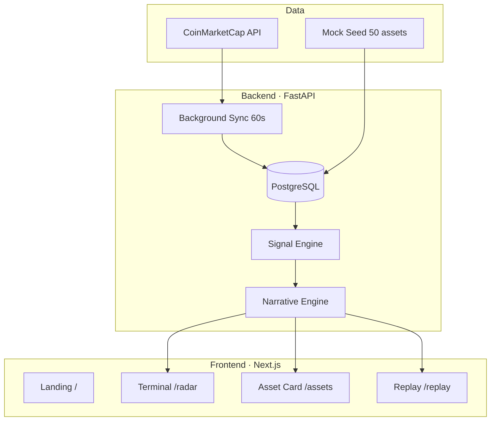

# Crypto Market Intelligence Radar

**Детерминированный intelligence-терминал для крипторынка.**  
Превращает рыночные данные в объяснимые сигналы, narrative и приоритеты — без «чёрного ящика» и без AI, который сам решает, что важно.

> *AI does not decide signals. Deterministic market logic is the source of truth.*

---

## Проблема

Крипторынок генерирует тысячи метрик в секунду. Трейдер и аналитик видят:

- таблицы цен и объёмов;
- десятки монет с «+2% / −1%»;
- алерты без контекста.

**Не хватает слоя между сырыми данными и решением:** что именно необычно, почему это необычно, насколько это важно и что изменилось относительно нормы.

CoinMarketCap показывает *что* происходит.  
**Radar показывает *что заслуживает внимания* и *почему*.**

---

## Решение

**Crypto Market Intelligence Radar (CMIR)** — платформа market intelligence, которая:

1. Забирает рыночные данные (CoinMarketCap или mock seed).
2. Детектирует аномалии **детерминированными правилами** (Volume / Price / Quiet Accumulation).
3. Считает **Radar Score** и **Narrative** (Accumulation, Momentum Expansion, Volatility Event…).
4. Объясняет каждый сигнал человеческим языком на странице актива.
5. Позволяет **перемотать** историю и показать: система увидела аномалию *до* очевидного движения.

```
Market Data  →  Signal Engine  →  Narrative  →  Action
     │               │                │              │
  CMC / Mock    Volume Shock      ACCUMULATION    /radar
                Price Shock       VOLATILITY      /assets
                Quiet Accum.      NORMAL          /replay
```

---

## Демо за 60 секунд (для жюри)

| Шаг | URL | Что показать |
|-----|-----|--------------|
| 1 | http://localhost:3000 | Landing: суть продукта, интерактивный radar-фон |
| 2 | http://localhost:3000/radar | Market Overview → Top Opportunities → Intelligence Feed → таблица |
| 3 | http://localhost:3000/assets/SOL | Price Shock: Current Status, Why Flagged, What Changed |
| 4 | http://localhost:3000/assets/LINK | Quiet Accumulation / Accumulation narrative |
| 5 | http://localhost:3000/replay?symbol=SOL | Слайдер: score и сигналы *до* скачка цены |

**Mock mode** работает без API-ключей — идеально для стенда на хакатоне.

---

## Ключевые возможности

### Market Intelligence Terminal (`/radar`)

- **Market Overview** — KPI: активы, сигналы, avg score, critical count, Market Mode
- **Top Opportunities** — топ-5 по Radar Score в стиле Bloomberg/Nansen
- **Intelligence Feed** — лента только **активных** событий
- **Radar Table** — 50 активов, поиск, фильтры, сортировка; нули скрыты, акцент на аномалиях

### Asset Intelligence Card (`/assets/[symbol]`)

- Current Status — активен ли сигнал прямо сейчас
- Why Radar Flagged — объяснение с реальными числами (z-score, volume ratio)
- Key Findings & What Changed — delta score, narrative, volume ratio
- Score Breakdown — только активные компоненты
- Charts с маркерами момента появления сигнала

### Signal Replay (`/replay`)

- Timeline slider по историческим snapshot'ам
- Price, Volume, Score, Signals, Narrative на каждой точке
- Доказывает ценность продукта: **раннее обнаружение**

---

## Signal Engine

Все сигналы — **правила, не ML**. Минимум **21 snapshot** истории. Lifecycle: `active` → `resolved`. Без дубликатов на каждый sync.

### Volume Shock

Объём 24h существенно выше baseline (20 предыдущих snapshots, без current).

| Условие | `volume_ratio >= 3.0` |
| Score | `min(100, round(max(0, ratio − 3) × 20 + 40))` |
| 3.0x → 40 · 5.0x → 80 · 6.0x → 100 |

### Price Shock

Z-score по **returns между snapshots** (не по CMC `percent_change_24h`).

| Условие | `|z_score| >= 3.0`, std >= 0.001 |
| Score | `min(100, round(max(0, |z| − 3) × 20 + 40))` |

### Quiet Accumulation

Объём растёт, цена остаётся flat.

| Условие | `volume_ratio >= 3.0` AND `|24h %| <= 2.0` |

### Radar Score (Composite)

| Компонент | Вес |
|-----------|-----|
| Volume Shock | 0.35 |
| Price Shock | 0.30 |
| Quiet Accumulation | 0.35 |

- 0 активных сигналов → score **0**
- 1 активный → score этого сигнала
- Несколько → weighted average

### Narrative Engine

| Активные сигналы | Narrative |
|------------------|-----------|
| Quiet Accumulation | ACCUMULATION |
| Volume + Price | MOMENTUM_EXPANSION |
| Price only | VOLATILITY_EVENT |
| Volume only | VOLUME_ANOMALY |
| Нет active | NORMAL |

---

## Архитектура



---

## Tech Stack

| Слой | Технологии |
|------|------------|
| Backend | Python 3.12, FastAPI, SQLAlchemy 2, Pydantic v2, Alembic |
| Database | PostgreSQL 16 |
| Frontend | Next.js 14, TypeScript, Tailwind CSS, Recharts |
| Infra | Docker Compose |
| Data | CoinMarketCap `listings/latest` (live) или seeded snapshots (mock) |

---

## Быстрый старт

### 1. Клонировать и настроить

```bash
cp .env.example .env
```

### 2. Запустить (mock mode — без ключей)

```bash
docker compose up --build
```

Полный reset БД + seed 50 активов × 25 snapshots:

```bash
docker compose down -v
docker compose up --build
```

### 3. Открыть

| Сервис | URL |
|--------|-----|
| Landing | http://localhost:3000 |
| Radar Terminal | http://localhost:3000/radar |
| Asset (demo) | http://localhost:3000/assets/SOL |
| Replay | http://localhost:3000/replay |
| API Docs | http://localhost:8000/docs |
| Debug Signals | http://localhost:8000/api/debug/signals |

---

## Live mode (CoinMarketCap)

Добавьте ключ в `.env`:

```env
CMC_API_KEY=your_key_here
CMC_LISTINGS_LIMIT=50
CMC_SYNC_INTERVAL_SECONDS=60
```

Ключ: https://coinmarketcap.com/api/

Badge на dashboard: `LIVE DATA · CoinMarketCap · Top 50`

> Один batch-запрос `listings/latest` на sync ≈ 1 credit. Интервал по умолчанию 60s.

---

## API

| Method | Endpoint | Описание |
|--------|----------|----------|
| GET | `/api/system/status` | Режим data source, sync interval |
| GET | `/api/radar` | Активы ranked by Radar Score + narrative |
| GET | `/api/signals` | Только **active** signals |
| GET | `/api/assets/{symbol}` | Detail + breakdown + timeline |
| GET | `/api/replay/{symbol}` | Исторический replay |
| GET | `/api/debug/signals` | Debug: ratios, z-scores, skip_reason |

---

## Структура проекта

```
ragnaR/
├── backend/
│   ├── app/
│   │   ├── signals/          # Volume / Price / Quiet + composite
│   │   ├── services/         # CMC sync, narrative, seed, replay
│   │   └── api/routes/       # REST endpoints
│   └── alembic/
├── frontend/
│   ├── app/                  # Pages: /, /radar, /assets, /replay
│   └── components/           # Terminal UI, charts, explanations
├── docker-compose.yml
└── .env.example
```

---

## Чем отличаемся

| | CoinMarketCap | **CMIR Radar** |
|---|---------------|----------------|
| Фокус | Цены и rankings | **Аномалии и приоритеты** |
| Логика | — | **Детерминированные правила** |
| Объяснение | — | Why Flagged, Key Findings, Narrative |
| История | Графики | **Signal Replay** с доказательством раннего детекта |
| AI | — | **Не используется** для решений о сигналах |

---

## Roadmap

- [ ] WebSocket real-time feed
- [ ] Alerts (Telegram / email)
- [ ] Portfolio watchlists
- [ ] Multi-exchange data
- [ ] Optional LLM layer *поверх* детерминированных сигналов (summarize, not decide)

---

## License

MIT — hackathon / MVP build.

---

<p align="center">
  <strong>Crypto Market Intelligence Radar</strong><br/>
  Detect unusual crypto market behavior before it becomes obvious.
</p>
